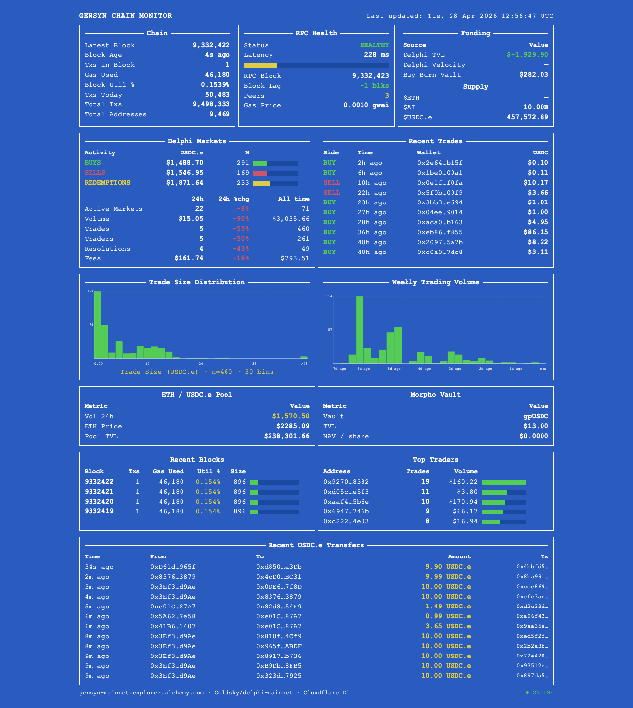

# Gensyn Chain Monitor

Live monitoring dashboard for the Gensyn mainnet. Available as a terminal app (Python/rich) and a web dashboard (Cloudflare Worker + D1).

## Dashboard preview



UI note: the Funding panel now clamps derived Delphi TVL at `$0.00` when cumulative sell/redemption flow exceeds cumulative buy flow, and shows an orange `net outflow` note instead of displaying a misleading negative TVL.

Deployment checklist: see [`docs/deployment-checklist.md`](docs/deployment-checklist.md).

---

## Terminal monitor

### Requirements

- Python 3.9+
- `rich` library

```bash
pip install rich
```

### Running

```bash
# with public RPC (limited data)
python monitor.py

# with private Alchemy endpoints (recommended)
export GENSYN_RPC_URL="https://gensyn-mainnet.g.alchemy.com/v2/YOUR_KEY"
export L1_RPC_URL="https://eth-mainnet.g.alchemy.com/v2/YOUR_KEY"
python monitor.py
```

The terminal dashboard refreshes every 2 seconds. Press `Ctrl+C` to exit.

### Syncing Delphi market data

Trade history is stored in a local SQLite database (`delphi.db`). To sync:

```bash
python db.py
```

`monitor.py` syncs automatically in the background every 30 seconds.

---

## Web dashboard

Hosted on Cloudflare Workers with Delphi trade data persisted in Cloudflare D1.

### Requirements

- Node.js 18+
- A Cloudflare account
- Alchemy API key (for private RPC endpoints)

### Setup

**1. Install Wrangler**

```bash
npm install
npx wrangler login
```

**2. Create the D1 database**

```bash
npx wrangler d1 create chain-monitor
```

Copy the `database_id` from the output and paste it into `wrangler.toml`.

**3. Apply the schema**

```bash
npx wrangler d1 execute chain-monitor --remote --file=schema.sql
```

**4. Set secrets**

```bash
npx wrangler secret put RPC_URL
# paste: https://gensyn-mainnet.g.alchemy.com/v2/YOUR_KEY

npx wrangler secret put L1_RPC_URL
# paste: https://eth-mainnet.g.alchemy.com/v2/YOUR_KEY
```

**5. Deploy**

```bash
npx wrangler deploy
```

### Local development

```bash
# normal local dev (web app + /api/data)
npx wrangler dev
```

Opens at `http://localhost:8787`. Uses the remote D1 database by default.

To test the scheduled Delphi sync locally, start Wrangler in scheduled-test mode:

```bash
npm run dev:scheduled
# or: npx wrangler dev --test-scheduled
```

Then trigger the scheduled handler manually:

```bash
curl "http://localhost:8787/__scheduled"
```

Note: `__scheduled` returns `404` when using plain `wrangler dev` without
`--test-scheduled`.
